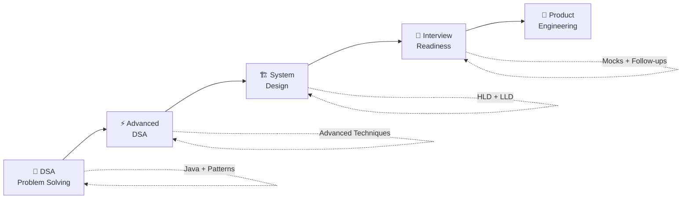
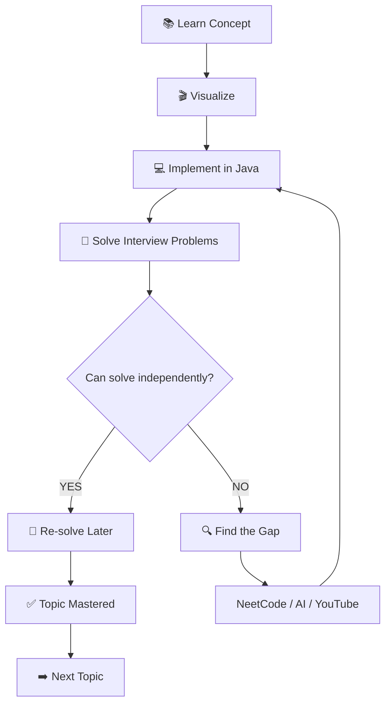
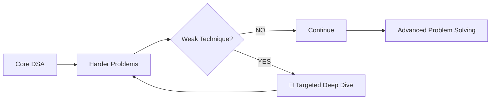
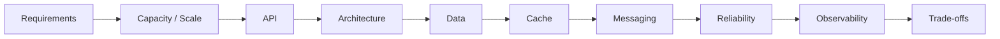
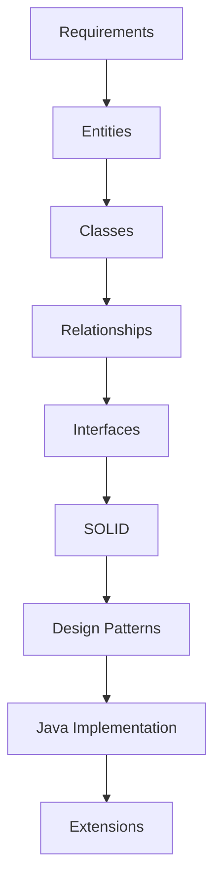
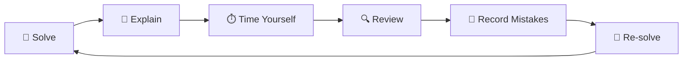
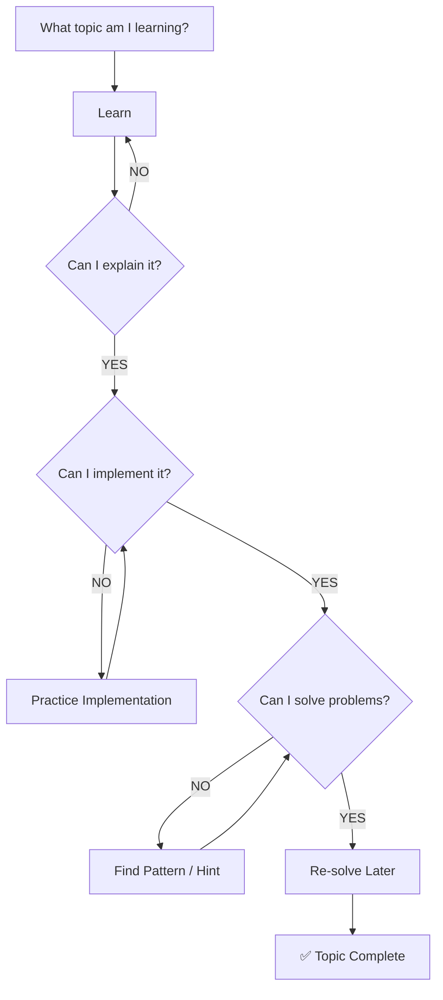

# 🚀 Product Engineering Interview Roadmap

<p align="center">
  <strong>DSA → Advanced DSA → System Design → Interview Readiness</strong>
</p>

<p align="center">
  <em>Learn → Practice → Find Gaps → Fix → Re-solve → Master</em>
</p>

---

## 🧭 The Big Picture



### 🎯 Core Rule

> **One primary resource → Practice → Identify the gap → Fix the gap → Re-solve → Move on**

The goal is **skill development**, not collecting courses.

---

# 🧠 01 · DSA + Problem Solving

## 🔄 Topic-by-Topic Learning Loop



### 🗂️ Topic Order

```text
Arrays
  ↓
Strings
  ↓
Hashing
  ↓
Two Pointers
  ↓
Sliding Window
  ↓
Linked List
  ↓
Stack & Queue
  ↓
Binary Search
  ↓
Recursion
  ↓
Trees & BST
  ↓
Heap / Priority Queue
  ↓
Sorting
  ↓
Greedy
  ↓
Intervals
  ↓
Backtracking
  ↓
Graphs
  ↓
Trie
  ↓
Dynamic Programming
  ↓
Bit Manipulation
```

### 🧩 Example: How One Topic Is Completed

```text
ARRAYS
  │
  ├── 📚 Learn
  │
  ├── 🎬 Visualize
  │
  ├── 💻 Implement in Java
  │
  ├── 🧩 Solve LeetCode
  │
  ├── 🔍 Find weak patterns
  │
  ├── 🔧 Use NeetCode / AI / YouTube
  │
  ├── 🔁 Re-solve without help
  │
  └── ✅ Mark Arrays complete
              ↓
           STRINGS
```

> **Do not finish one entire resource before starting another.**
>
> Complete the resources **around each topic**.

---

# ⚡ 02 · Advanced DSA

Advanced DSA is an **extension of the DSA foundation**, not automatically another full course.



### 🔥 Core Advanced Topics

```text
Advanced Graphs
Dijkstra
Topological Sort
Union-Find / DSU
Minimum Spanning Tree
Advanced Dynamic Programming
Trie
Monotonic Stack / Queue
Binary Search on Answer
Advanced Trees
Backtracking
Divide & Conquer
Advanced Greedy
Prefix Sum
Bit Manipulation
```

### 🧪 Selective Topics

```text
Segment Tree
Fenwick Tree
Advanced Range Queries
```

> **Rule:** Don't study advanced topics just because they exist.
>
> Add them when interview practice or target roles show that you need them.

---

# 🏗️ 03 · System Design

System Design has two tracks:

```text
                    🏗️ SYSTEM DESIGN
                           │
                ┌──────────┴──────────┐
                ↓                     ↓
             🏢 HLD                 🧱 LLD
                │                     │
        Architecture              OOP
        Scalability               SOLID
        Databases                Patterns
        Caching                  Classes
        Messaging                Interfaces
        Reliability              Relationships
        Trade-offs               Java
```

## 🏢 HLD Framework



### Core HLD Topics

```text
Load Balancing
API Gateway
CDN
Caching / Redis
SQL / NoSQL
Replication
Partitioning
Sharding
Message Queues
Kafka
Search
Rate Limiting
Microservices
Fault Tolerance
Observability
Consistency
Availability
Scalability
Security
```

## 🧱 LLD Framework



### Design Patterns

```text
Creational
  Factory
  Abstract Factory
  Builder
  Singleton
  Prototype

Structural
  Adapter
  Decorator
  Facade
  Composite
  Proxy
  Bridge

Behavioral
  Strategy
  Observer
  Command
  State
  Template Method
  Chain of Responsibility
  Iterator
```

---

# 🧪 04 · System Design Practice

Don't just watch system-design videos.

Use this loop:

```text
Learn Concept
     ↓
Understand Architecture
     ↓
Design Yourself
     ↓
Compare With Reference
     ↓
Find Gaps
     ↓
Deep Dive
     ↓
Redesign
     ↓
Explain Out Loud
```

### 🏗️ Practice Systems

```text
🔗 URL Shortener
🚦 Rate Limiter
🔔 Notification System
📁 File Storage
💬 Chat System
📰 News Feed
🔎 Search System
🎥 Video Streaming
💳 Payment System
🚕 Ride Sharing
```

---

# 🎤 05 · Interview Readiness

## 💻 Coding Interview

```text
Understand Problem
        ↓
Clarify Requirements
        ↓
Think of Approaches
        ↓
Explain Approach
        ↓
Code
        ↓
Test Edge Cases
        ↓
Time & Space Complexity
        ↓
Follow-up
```

## 🏢 HLD Interview

```text
Requirements
      ↓
Scale
      ↓
API
      ↓
Architecture
      ↓
Data
      ↓
Cache
      ↓
Messaging
      ↓
Reliability
      ↓
Trade-offs
```

## 🧱 LLD Interview

```text
Requirements
      ↓
Entities
      ↓
Classes
      ↓
Relationships
      ↓
Interfaces
      ↓
SOLID
      ↓
Patterns
      ↓
Java
      ↓
Extensions
```

---

# 🎤 06 · Mock Interview Loop



### Interview Performance Checklist

```text
☐ Understand the problem
☐ Ask useful clarifying questions
☐ Explain before coding
☐ Consider edge cases
☐ Write clean Java
☐ Test the solution
☐ State Big-O
☐ Handle follow-ups
☐ Explain trade-offs
```

---

# 🤖 07 · AI = Your Learning & Interview Coach

AI is a **support layer**, not a replacement for solving problems yourself.

### 🧠 DSA Prompts

```text
"Give me a hint only."

"Don't give me the solution."

"Review my approach."

"Find the missing edge cases."

"Give me a similar problem."

"Explain why my approach fails."

"Interview me on this problem."
```

### 🏗️ System Design Prompts

```text
"Interview me on this design."

"Don't give me the architecture."

"Challenge my design."

"Find scalability problems."

"Ask senior-level follow-ups."

"Review my trade-offs."

"Tell me what I forgot."
```

> **Use AI to improve your reasoning — not to replace it.**

---

# 📚 08 · Resource Dashboard

| Area               | Primary Resource          | Add More Only When                       |
| ------------------ | ------------------------- | ---------------------------------------- |
| Java DSA           | Scott Barrett             | Concept is unclear                       |
| Visualization      | DSA Animator              | Need another visual explanation          |
| Core Problems      | LeetCode 75               | Need broader practice                    |
| Pattern Practice   | NeetCode 150              | A pattern remains weak                   |
| Implementation     | NeetCode Core Skills      | Data structure implementation is weak    |
| Advanced DSA       | DSA Animator + Practice   | A specific advanced topic is weak        |
| HLD                | DSA Animator + ByteByteGo | Architecture concept needs deeper study  |
| LLD                | DSA Animator              | OOP / SOLID / patterns need deeper study |
| Deep HLD           | System Design Masterclass | Specific HLD gap remains                 |
| Deep LLD           | LLD resource              | Specific LLD gap remains                 |
| Interview Practice | Timed Practice + Mocks    | Need interview simulation                |
| AI                 | AI Coach                  | Need hints, review or simulation         |

---

# 🧭 09 · Daily Decision System

Don't ask:

> **"Which course should I watch today?"**

Ask:



---

# 📊 10 · Progress Tracking

Track **skills**, not just videos.

```text
DSA
├── Arrays             ☐
├── Strings            ☐
├── Hashing            ☐
├── Linked List        ☐
├── Trees              ☐
├── Graphs             ☐
└── Dynamic Programming ☐

Advanced DSA
├── Dijkstra           ☐
├── Union-Find         ☐
├── Topological Sort   ☐
├── Advanced DP        ☐
└── Monotonic Stack    ☐

System Design
├── HLD Fundamentals   ☐
├── Databases          ☐
├── Caching             ☐
├── Messaging           ☐
├── Scalability         ☐
└── Reliability         ☐

LLD
├── OOP                 ☐
├── SOLID               ☐
├── Design Patterns     ☐
└── Machine Coding      ☐

Interview
├── Coding Mocks        ☐
├── HLD Mocks           ☐
├── LLD Mocks           ☐
└── Follow-ups          ☐
```

---

# 🏆 Final Philosophy

```text
        ┌───────────────┐
        │     LEARN     │
        └───────┬───────┘
                ↓
        ┌───────────────┐
        │    PRACTICE   │
        └───────┬───────┘
                ↓
        ┌───────────────┐
        │  FIND THE GAP │
        └───────┬───────┘
                ↓
        ┌───────────────┐
        │   FIX THE GAP │
        └───────┬───────┘
                ↓
        ┌───────────────┐
        │   RE-SOLVE    │
        └───────┬───────┘
                ↓
        ┌───────────────┐
        │    MASTER     │
        └───────┬───────┘
                ↓
        ┌───────────────┐
        │   INTERVIEW   │
        └───────────────┘
```

## 🚀 Don't Collect Courses. Build Skills.

**Learn → Practice → Identify → Fix → Re-solve → Master → Interview**

---


# 🔗 Resource Links

The repository intentionally keeps the resource list centralized so links don't have to be maintained in multiple sections.

### 🧠 DSA

* 📚 [**Scott Barrett — Java DSA + LeetCode**](https://www.udemy.com/course/data-structures-and-algorithms-java/)
* 🎬 [**DSA Animator**](https://www.dsaanimator.com/)
* 🧩 [**LeetCode 75**](https://leetcode.com/studyplan/leetcode-75/)
* 🧠 [**NeetCode 150**](https://neetcode.io/practice/practice/neetcode150)
* 💻 [**NeetCode Core Skills**](https://neetcode.io/practice/practice/coreSkills)

### ⚡ Advanced DSA

* 🎬 [**DSA Animator**](https://www.dsaanimator.com/)
* 🧠 [**NeetCode 150**](https://neetcode.io/practice/practice/neetcode150)
* 💻 [**NeetCode Core Skills**](https://neetcode.io/practice/practice/coreSkills)

### 🏗️ System Design

* 🎬 [**DSA Animator**](https://www.dsaanimator.com/)
* 📺 [**ByteByteGo**](https://bytebytego.com/)
* 🎓 [**System Design Masterclass**](https://www.udemy.com/course/system-design-masterclass/)
* 🧱 [**Low Level System Design — Java**](https://www.udemy.com/course/low-level-system-design-java-with-problem-solving/)

### 🎤 Interview Practice

* 🧩 [**LeetCode 75**](https://leetcode.com/studyplan/leetcode-75/)
* 🧠 [**NeetCode 150**](https://neetcode.io/practice/practice/neetcode150)
* 🎬 [**DSA Animator**](https://www.dsaanimator.com/)
* 📺 [**ByteByteGo**](https://bytebytego.com/)

---

<p align="center">
  <strong>Build the fundamentals. Practice deliberately. Fix your gaps. Think like an engineer.</strong>
</p>
