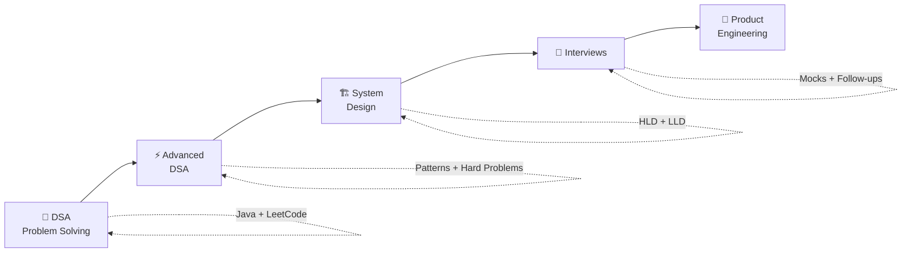
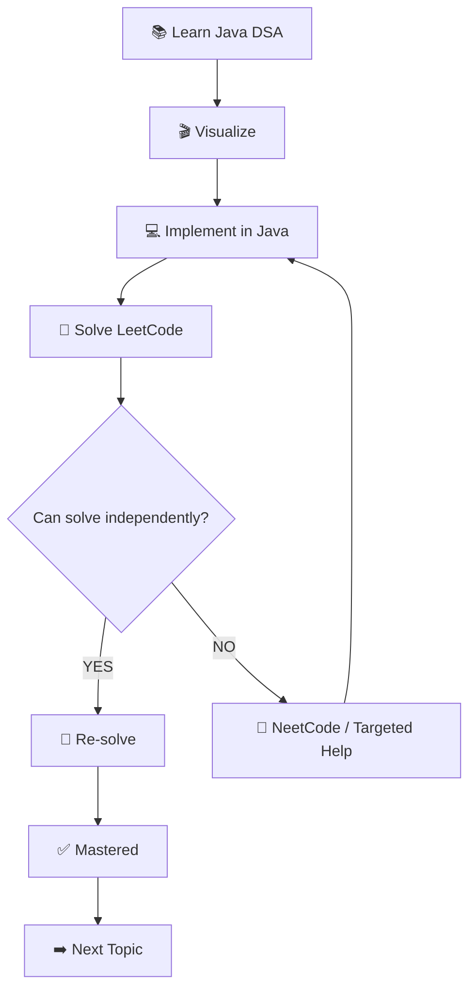
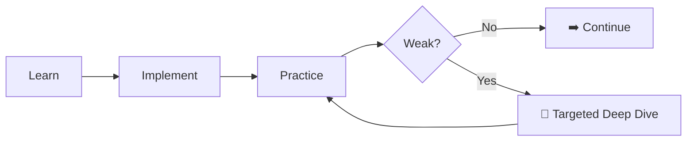
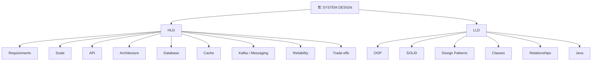
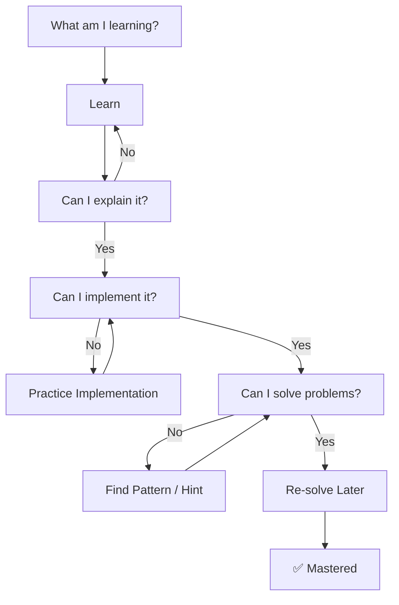

# 🚀 Product Engineering Interview Roadmap

<p align="center">
  <strong>DSA → Advanced DSA → System Design → Interview Readiness</strong>
</p>

<p align="center">
  <em>Learn less. Practice more. Fix gaps. Build interview confidence.</em>
</p>

---

## 🧭 The Big Picture



### 🎯 The Rule

> **One primary resource → Practice → Find the gap → Fix only the gap → Re-solve → Master**

No unnecessary course duplication.

---

# 🧠 01 · DSA + Problem Solving

## 🔄 Learn → Visualize → Code → Solve



## 🗂️ Topic Journey

```text
Arrays
  ↓
Strings
  ↓
Hashing
  ↓
Two Pointers
  ↓
Sliding Window
  ↓
Linked List
  ↓
Stack & Queue
  ↓
Binary Search
  ↓
Recursion
  ↓
Trees & BST
  ↓
Heap
  ↓
Sorting
  ↓
Greedy
  ↓
Intervals
  ↓
Backtracking
  ↓
Graphs
  ↓
Trie
  ↓
Dynamic Programming
  ↓
Bit Manipulation
```

### 🧰 Resource Roles

| 🎯 Resource                  | 🧩 Job                             |
| ---------------------------- | ---------------------------------- |
| **Scott Barrett — Java DSA** | Learn / revise concepts in Java    |
| **DSA Animator**             | Visualize algorithms and execution |
| **LeetCode 75**              | Main interview practice            |
| **NeetCode 150**             | Repair weak patterns               |
| **NeetCode Core Skills**     | Strengthen implementation          |

> 💡 **Don't complete these resources one after another.**
> Complete them **topic-by-topic**.

---

# ⚡ 02 · Advanced DSA

## 🚫 No Separate Course Initially

Use **DSA Animator + problem solving** first.



### 🔥 Core Advanced Topics

`Advanced Graphs` · `Dijkstra` · `Topological Sort` · `Union-Find` · `MST` · `Trie` · `Advanced DP` · `Monotonic Stack/Queue` · `Binary Search on Answer` · `Advanced Trees` · `Divide & Conquer` · `Advanced Greedy` · `Prefix Sum` · `Bit Manipulation`

### 🧪 Selective

`Segment Tree` · `Fenwick Tree` · `Advanced Range Queries`

> **Only deep-dive when practice proves you need it.**

---

# 🏗️ 03 · System Design

## 🎬 Start With DSA Animator



### 🧩 Practice Designs

```text
🔗 URL Shortener
🚦 Rate Limiter
🔔 Notification System
📁 File Storage
💬 Chat System
📰 News Feed
🔎 Search System
🎥 Video Streaming
💳 Payment System
🚕 Ride Sharing
```

### 🧰 Resource Strategy

**Primary**

* 🎬 DSA Animator
* 📺 ByteByteGo

**Deep Dive — Only When Needed**

* 🎓 System Design Masterclass
* 🎓 Low Level System Design — Java

> **Don't study every System Design resource completely.**
>
> Start with DSA Animator → practice a design → identify the gap → deep-dive only that gap.

---

# 🎤 04 · Interview Readiness

## 💻 Coding Interview

```text
Problem
   ↓
Clarify
   ↓
Think
   ↓
Explain
   ↓
Code
   ↓
Test
   ↓
Big-O
   ↓
Follow-up
```

## 🏗️ HLD Interview

```text
Requirements
      ↓
Scale
      ↓
API
      ↓
Architecture
      ↓
Data
      ↓
Cache
      ↓
Messaging
      ↓
Reliability
      ↓
Trade-offs
```

## 🧱 LLD Interview

```text
Requirements
      ↓
Entities
      ↓
Classes
      ↓
Relationships
      ↓
Interfaces
      ↓
SOLID
      ↓
Patterns
      ↓
Java
      ↓
Extensions
```

### 🎯 Final Simulation

```text
        DSA
         +
        HLD
         +
        LLD
         +
   Java / Spring
         ↓
   🎤 Mock Interview
         ↓
   🔍 Review Mistakes
         ↓
   🔁 Repeat
```

---

# 🤖 05 · AI = Your Interview Coach

### 🧠 DSA

```text
"Give me a hint only."
"Don't give me the solution."
"Review my approach."
"Find my edge cases."
"Give me a similar problem."
```

### 🏗️ System Design

```text
"Interview me."
"Don't give me the architecture."
"Challenge my design."
"Find scalability problems."
"Ask senior follow-ups."
"Review my trade-offs."
```

> **AI should improve your thinking — not replace it.**

---

# 📚 06 · Resource Dashboard

| Area           | 🥇 Primary                | 🔧 When to Add More        |
| -------------- | ------------------------- | -------------------------- |
| Java DSA       | Scott Barrett             | Concept unclear            |
| Visualization  | DSA Animator              | Specific gap               |
| Coding         | LeetCode 75               | Need more problems         |
| Weak Patterns  | NeetCode 150              | Pattern weak               |
| Implementation | NeetCode Core Skills      | Coding implementation weak |
| Advanced DSA   | DSA Animator + Practice   | Specific advanced gap      |
| HLD            | DSA Animator              | Concept/design gap         |
| LLD            | DSA Animator              | Concept/design gap         |
| HLD Visuals    | ByteByteGo                | Need visual explanation    |
| Deep HLD       | System Design Masterclass | DSA Animator insufficient  |
| Deep LLD       | LLD Java                  | DSA Animator insufficient  |
| Interviews     | Timed Practice + Mocks    | Need simulation            |
| AI             | AI Coach                  | Hints / review / practice  |

---

# 🧭 07 · The Daily Decision System

Don't ask:

> **"Which course should I watch today?"**

Ask:



---

# 🏆 Final Philosophy

```text
             ┌─────────────────┐
             │      LEARN      │
             └────────┬────────┘
                      ↓
             ┌─────────────────┐
             │    PRACTICE     │
             └────────┬────────┘
                      ↓
             ┌─────────────────┐
             │   FIND THE GAP  │
             └────────┬────────┘
                      ↓
             ┌─────────────────┐
             │   FIX THE GAP   │
             └────────┬────────┘
                      ↓
             ┌─────────────────┐
             │    RE-SOLVE     │
             └────────┬────────┘
                      ↓
             ┌─────────────────┐
             │     MASTER      │
             └────────┬────────┘
                      ↓
             ┌─────────────────┐
             │    INTERVIEW    │
             └─────────────────┘
```

## 🚀 Don't Collect Courses. Build Skills.

**Learn → Practice → Identify → Fix → Re-solve → Master → Interview**

---

### 🔗 Resource Links

**DSA**

* Scott Barrett — Java DSA + LeetCode
* DSA Animator
* LeetCode 75
* NeetCode 150
* NeetCode Core Skills

**System Design**

* DSA Animator
* ByteByteGo
* System Design Masterclass — Udemy
* Low Level System Design — Java — Udemy
